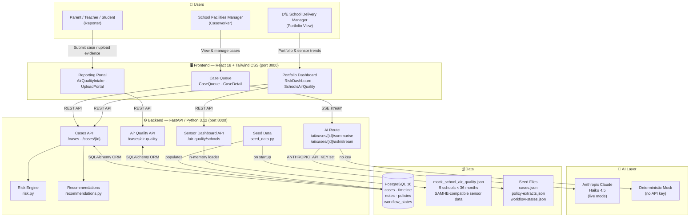
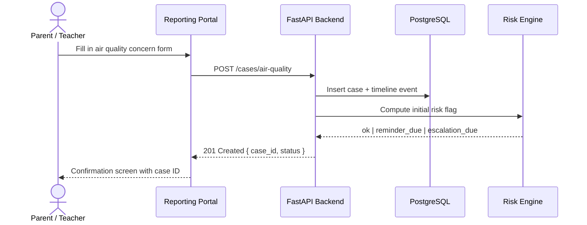
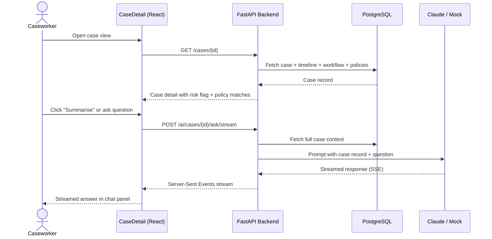
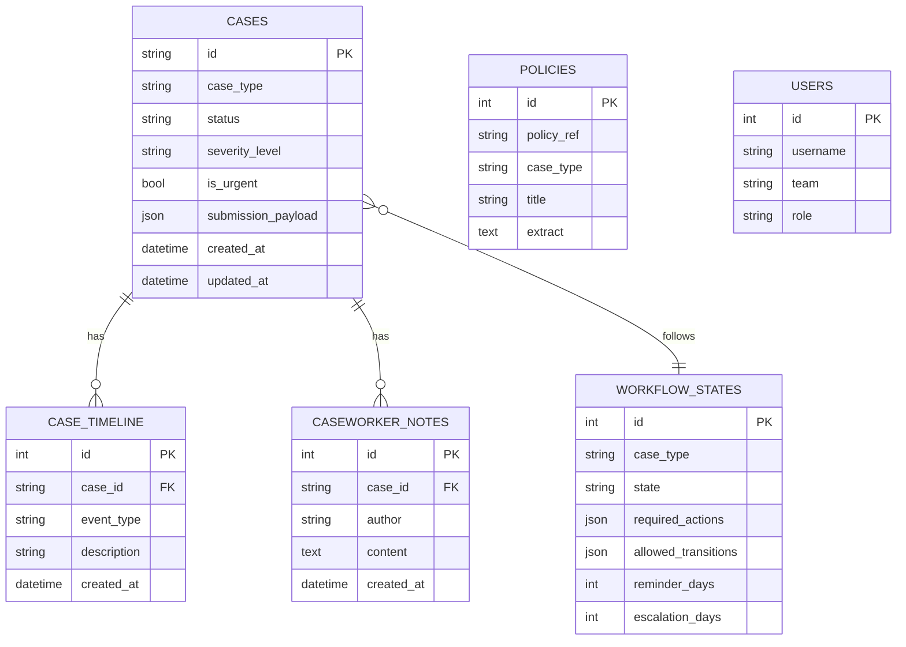
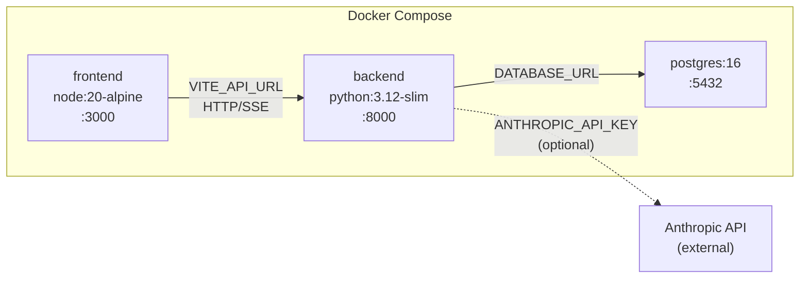

# Architecture

## System Overview

---

## Request Flow: Case Submission

---

## Request Flow: Caseworker AI Summary

---

## Data Model

---

## Deployment

| Service | Image | Port | Key Env Vars |
|---|---|---|---|
| `frontend` | node:20-alpine | 3000 | `VITE_API_URL` |
| `backend` | python:3.12-slim | 8000 | `DATABASE_URL`, `ANTHROPIC_API_KEY` |
| `db` | postgres:16 | 5432 | `POSTGRES_DB`, `POSTGRES_USER`, `POSTGRES_PASSWORD` |
